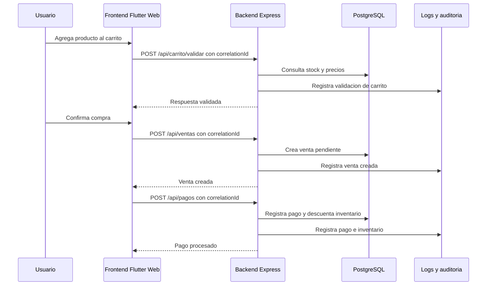

# Arquitectura de Auditoria, Observabilidad y Transacciones

Proyecto: Aromas Store  
Fecha: 2026-07-22  
Estado: Propuesta documental, sin implementacion en codigo todavia

## Objetivo

Definir una base profesional para que Aromas Store pueda registrar, seguir y diagnosticar las acciones importantes del usuario y del sistema.

La idea es que cada operacion relevante tenga una traza clara desde que nace en el frontend hasta que termina en el backend, la base de datos o un servicio externo.

Esto aplica especialmente a:

- inicio de sesion;
- consulta de catalogo;
- validacion de carrito;
- creacion de venta;
- registro de pago;
- generacion de factura;
- actualizacion de inventario;
- errores de negocio o errores tecnicos.

## Principio central

Cada transaccion importante debe tener un identificador unico.

Ese identificador debe viajar por todos los pasos del flujo para poder responder preguntas como:

- que usuario ejecuto la accion;
- desde donde se ejecuto;
- que endpoint se invoco;
- que datos principales se enviaron;
- que respuesta recibio;
- cuanto tiempo tardo;
- en que paso fallo;
- si fue un error de negocio, de validacion, de base de datos o de servicio externo.

## Conceptos clave

| Concepto | Proposito |
|---|---|
| Correlation ID | Une todos los eventos de una misma operacion. |
| Trace ID | Permite ver el recorrido tecnico de una peticion entre servicios. |
| Transaction ID | Identifica una operacion de negocio, como pago, venta o factura. |
| Audit log | Registra quien hizo que, cuando, desde donde y con que resultado. |
| Event log | Registra eventos tecnicos y de negocio para diagnostico. |
| Metricas | Permiten medir volumen, tiempos, errores y disponibilidad. |
| Trazas | Permiten reconstruir el camino completo de una operacion. |

## Estructura recomendada de request

Para flujos transaccionales futuros, el request deberia tener una seccion de auditoria y una seccion de datos de negocio.

Ejemplo conceptual:

```json
{
  "auditoria": {
    "correlationId": "b7b2b7b6-6d0c-4c6f-9d1a-3b6c5c2d9f21",
    "traceId": "trace-20260722-001",
    "canal": "WEB",
    "ipCliente": "127.0.0.1",
    "usuarioId": 1,
    "rol": "Cliente",
    "accion": "CREAR_VENTA",
    "fechaSolicitud": "2026-07-22T22:45:00-05:00"
  },
  "datos": {
    "clienteId": 3,
    "items": [
      {
        "productoId": 1,
        "cantidad": 2
      }
    ]
  }
}
```

## Estructura recomendada de response

La respuesta deberia separar el resultado tecnico, el resultado de negocio y la informacion util para trazabilidad.

Ejemplo exitoso:

```json
{
  "respuesta": {
    "codigo": "00000",
    "mensaje": "Operacion procesada correctamente",
    "operacionProcesada": true,
    "fechaRespuesta": "2026-07-22T22:45:03-05:00",
    "correlationId": "b7b2b7b6-6d0c-4c6f-9d1a-3b6c5c2d9f21",
    "transactionId": "VEN-20260722-0001"
  },
  "datos": {
    "ventaId": 15,
    "estado": "PENDIENTE",
    "subtotal": 139.98,
    "impuesto": 21.00,
    "total": 160.98
  }
}
```

Ejemplo con error controlado:

```json
{
  "respuesta": {
    "codigo": "STOCK_INSUFICIENTE",
    "mensaje": "No existe stock suficiente para completar la operacion",
    "operacionProcesada": false,
    "fechaRespuesta": "2026-07-22T22:46:10-05:00",
    "correlationId": "b7b2b7b6-6d0c-4c6f-9d1a-3b6c5c2d9f21",
    "transactionId": null
  },
  "error": {
    "tipo": "NEGOCIO",
    "detalle": "Producto 1 solicitado: 5, disponible: 2"
  }
}
```

Ejemplo con error tecnico:

```json
{
  "respuesta": {
    "codigo": "ERROR_MICROSERVICIO",
    "mensaje": "No fue posible procesar la operacion en este momento",
    "operacionProcesada": false,
    "fechaRespuesta": "2026-07-22T22:47:20-05:00",
    "correlationId": "b7b2b7b6-6d0c-4c6f-9d1a-3b6c5c2d9f21",
    "transactionId": null
  },
  "error": {
    "tipo": "TECNICO",
    "servicio": "pagos",
    "detalleSeguro": "Error al invocar servicio de pagos"
  }
}
```

## Auditoria funcional

La auditoria funcional debe enfocarse en acciones sensibles del sistema.

Eventos recomendados:

| Evento | Debe registrar |
|---|---|
| LOGIN_EXITOSO | Usuario, rol, fecha, IP, canal. |
| LOGIN_FALLIDO | Identificador usado, fecha, IP, motivo seguro. |
| CARRITO_VALIDADO | Usuario o sesion, productos, resultado, total calculado. |
| VENTA_CREADA | Cliente, venta, total, estado inicial. |
| PAGO_REGISTRADO | Venta, metodo, monto, estado, numero de transaccion. |
| FACTURA_GENERADA | Venta, factura, numero, total. |
| INVENTARIO_ACTUALIZADO | Producto, cantidad anterior, cantidad nueva, motivo. |
| ERROR_TRANSACCIONAL | Endpoint, codigo, mensaje, correlationId, servicio afectado. |

## Observabilidad tecnica

A futuro, el backend puede producir tres tipos de senales:

| Senal | Ejemplo |
|---|---|
| Logs | "Pago registrado correctamente para venta 15". |
| Metricas | Tiempo promedio de `POST /api/pagos`. |
| Trazas | Flujo completo: frontend -> backend -> base de datos -> respuesta. |

Campos minimos recomendados en logs:

- timestamp;
- level;
- service;
- environment;
- endpoint;
- method;
- statusCode;
- durationMs;
- userId;
- role;
- correlationId;
- traceId;
- transactionId;
- message.

## Seguridad

La observabilidad no debe exponer informacion sensible.

No registrar:

- contrasenas;
- tokens JWT completos;
- datos de tarjetas;
- secretos de entorno;
- cabeceras sensibles;
- datos personales innecesarios.

Si se requiere guardar identificacion, se recomienda registrar solo lo necesario para auditoria y cumplir reglas de minimizacion de datos.

## Aplicacion gradual en Aromas Store

La implementacion debe avanzar por etapas.

### Etapa 1: Documento y estandar

Estado actual: definido en este documento.

Objetivo:

- acordar nombres;
- definir estructura de request y response;
- establecer campos minimos de auditoria;
- preparar la bitacora para futuras historias.

### Etapa 2: Middleware de correlation ID

Objetivo futuro:

- generar un `correlationId` si el frontend no lo envia;
- devolverlo siempre en la respuesta;
- incluirlo en logs del backend.

### Etapa 3: Respuestas transaccionales uniformes

Objetivo futuro:

- unificar respuestas de login, ventas, pagos, facturas y carrito;
- separar `respuesta`, `datos` y `error`;
- mantener compatibilidad con el frontend.

### Etapa 4: Auditoria persistente

Objetivo futuro:

- crear tabla de auditoria;
- registrar eventos sensibles;
- consultar trazas por usuario, venta, factura o correlationId.

### Etapa 5: Observabilidad avanzada

Objetivo futuro:

- agregar metricas;
- agregar trazas distribuidas;
- conectar con herramientas externas si el proyecto lo requiere.

## Flujo objetivo de una compra



## Decision actual

Por ahora no se modifica codigo.

Este documento queda como guia para implementar despues una capa de auditoria y observabilidad profesional, empezando por el backend y conectandola progresivamente con el frontend.

## Archivos relacionados

- `docs/backend/API_DOCUMENTACION.md`
- `docs/proyecto/BITACORA_PROYECTO.md`
- `docs/frontend/FRONTEND_REFACTORIZACION_ESTRUCTURAL.md`
